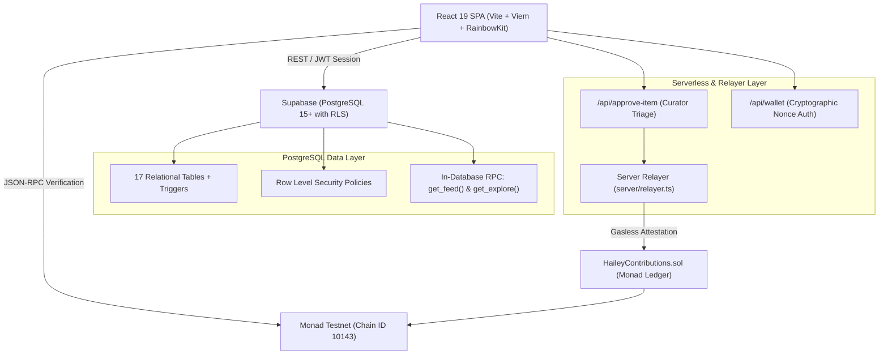

# Hailey — Autonomous Cultural Atlas

> **Hailey** is an open cultural discovery engine and onchain archival ledger. It connects underground subcultures, heritage traditions, and sonic movements into an explainable graph — verified on the **Monad Testnet** blockchain and curated by decentralized community collectives.

---

## The Hero Flow

```
1. Discover ──> 2. Personalize ──> 3. Understand Why ──> 4. Join Collectives ──> 5. Contribute ──> 6. Curate & Triage ──> 7. Verify Onchain
```

1. **Discover**: Explore an open graph of 65+ cultural taxonomy tags and 148 thematic edges spanning heritage, sound, fashion, and culinary traditions.
2. **Personalize**: Select 3 to 10 interest threads during onboarding to calibrate your feed.
3. **Understand Why**: Every dispatch in your feed includes a transparent **WhyStamp** (e.g. `BECAUSE · STREETWEAR + JAPANESE`), eliminating algorithmic opacity.
4. **Join Collectives**: Participate in 8 focused cultural collectives (such as Tokyo Underground, Bronx Hip-Hop Origins, and Dub Sound Systems).
5. **Contribute**: Propose archival dispatches, link citations, and primary sources to community collections.
6. **Curate & Triage**: Designated collective curators review pending proposals via an anti-self-dealing triage workflow.
7. **Verify Onchain**: Approved contributions are canonically hashed (EIP-712 / Keccak256) and recorded on the **Monad Testnet**, granting immutable provenance and onchain verification seals.

---

## Architecture



---

## Tech Stack

- **Frontend**: React 19, Vite, React Router v7, TanStack Query v5, Tailwind CSS v4.
- **Web3 & Blockchain**: Viem, Wagmi, RainbowKit, Solidity 0.8.24, Foundry, Monad Testnet (`10143`).
- **Backend & Database**: Supabase (PostgreSQL 15+), Row Level Security (RLS), PL/pgSQL RPC ranking functions.
- **Serverless API**: Vercel Serverless Functions (`/api/approve-item`, `/api/wallet`, `/api/health`).
- **Testing & Tooling**: Vitest, TSX, Oxlint.

---

## Environment Variables

Create `.env.local` for local development. Only browser-safe variables use the `VITE_` prefix:

```env
# Browser-safe (Public)
VITE_SUPABASE_URL=https://<your-project-id>.supabase.co
VITE_SUPABASE_ANON_KEY=<your-supabase-anon-key>
VITE_WALLET_CONNECT_ID=<your-reown-project-id>
VITE_CONTRACT_ADDRESS=<your-deployed-contract-address>
VITE_EXPLORER_URL=https://testnet.monadexplorer.com

# Server-only (Never exposed to browser)
SUPABASE_URL=https://<your-project-id>.supabase.co
SUPABASE_SERVICE_ROLE_KEY=<your-supabase-service-role-key>
RELAYER_PRIVATE_KEY=<your-funded-monad-private-key>
MONAD_RPC_URL=https://testnet-rpc.monad.xyz
```

---

## Local Setup & Quickstart

```bash
# 1. Clone repository & install dependencies
git clone https://github.com/jeevansurya560-arch/Hailey.git
cd Hailey
npm install

# 2. Seed database with taxonomy, demo accounts & communities
npm run seed

# 3. Start local development server
npm run dev

# 4. Run test suites & verification checks
npm test                    # Vitest unit test suite
npm run rls-check           # Security & RLS attack vector audit
npm run check-approval      # Curator approval triage test
npm run check-feed          # In-database feed ranking test
npm run check-chain         # Monad contract verification check
```

---

## Verification & Test Results

All test suites and verification benchmarks pass cleanly:

| Test Suite | Command | Coverage | Result |
| :--- | :--- | :--- | :--- |
| **Hashing Engine** | `npm test` | Canonical serialization & EIP-712 keccak256 | ✅ 3/3 Tests Passed |
| **RLS Security Audit** | `npm run rls-check` | 8 isolation & privilege escalation attack vectors | ✅ 8/8 Checks Passed |
| **Curator Triage** | `npm run check-approval` | Non-curator rejection, anti-self-dealing & duplicate guard | ✅ 4/4 Checks Passed |
| **Feed Ranking** | `npm run check-feed` | Explainable attribution stamps & exploration interleaving | ✅ Verified |
| **Monad Ledger** | `npm run check-chain` | Onchain state sync & public Viem read | ✅ Verified |
| **Production Build** | `npm run build` | Vite asset bundling & zero syntax errors | ✅ Built in 1.25s |

---

## Honest Limitations

1. **Testnet Environment**: Deployed on Monad Testnet (Chain ID `10143`). Smart contracts are designed for hackathon demonstration and have not undergone a third-party security audit.
2. **Single Relayer Model**: Gasless attestations are sponsored via a centralized backend relayer for seamless UX without requiring users to acquire testnet faucet tokens.
3. **Transparent Heuristic Ranking**: Feed personalization uses an explainable in-database dot-product with exponential time decay, intentionally avoiding opaque neural networks or black-box tracking.
