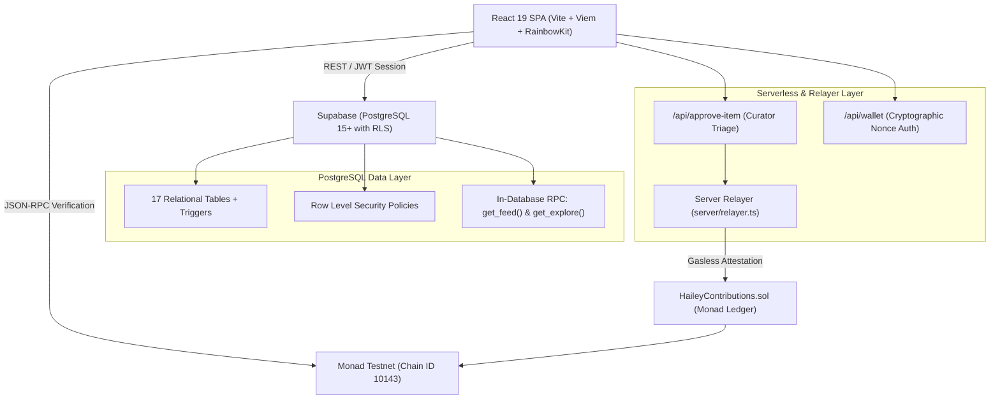

# Hailey — Autonomous Cultural Atlas

> **Hailey** is an open cultural discovery engine and onchain archival ledger. It connects underground subcultures, heritage traditions, and sonic movements into an explainable graph — verified on the **Monad Testnet** blockchain and curated by decentralized community collectives.

---

## The Hero Flow

```
1. Discover ──> 2. Personalize ──> 3. Understand Why ──> 4. Join Collectives ──> 5. Contribute ──> 6. Curate & Triage ──> 7. Verify Onchain
```

1. **Discover**: Explore an open graph of 65+ cultural taxonomy tags and 148 thematic edges spanning heritage, sound, fashion, and culinary traditions.
2. **Personalize**: Select 3 to 10 interest threads during onboarding to calibrate your feed.
3. **Understand Why**: Every dispatch in your feed includes a transparent **WhyStamp** (e.g. `BECAUSE · STREETWEAR + JAPANESE`), eliminating algorithmic opacity.
4. **Join Collectives**: Participate in 8 focused cultural collectives (such as Tokyo Underground, Bronx Hip-Hop Origins, and Dub Sound Systems).
5. **Contribute**: Propose archival dispatches, link citations, and primary sources to community collections.
6. **Curate & Triage**: Designated collective curators review pending proposals via an anti-self-dealing triage workflow.
7. **Verify Onchain**: Approved contributions are canonically hashed (EIP-712 / Keccak256) and recorded on the **Monad Testnet**, granting immutable provenance and onchain verification seals.

---

## Architecture



---

## Tech Stack

- **Frontend**: React 19, Vite, React Router v7, TanStack Query v5, Tailwind CSS v4.
- **Web3 & Blockchain**: Viem, Wagmi, RainbowKit, Solidity 0.8.24, Foundry, Monad Testnet (`10143`).
- **Backend & Database**: Supabase (PostgreSQL 15+), Row Level Security (RLS), PL/pgSQL RPC ranking functions.
- **Serverless API**: Vercel Serverless Functions (`/api/approve-item`, `/api/wallet`, `/api/payments`, `/api/tickets`, `/api/markets`).
- **Testing & Tooling**: Vitest (58 tests across 10 test suites), Oxlint (0 warnings, 0 errors).

---

## The 3 Core Product Capabilities

### A. Paid Curation
- **Concept**: Curation is directly funded by the people who benefit from it.
- **Implementation**: `curation_payments` records payer, curator, collection/post, amount, 5% protocol fee, and 95% curator payout.
- **Security**: Authoritative server-side calculation, replay protection against duplicate transaction hashes, and strict RLS blocking unauthenticated inserts or payout tampering.
- **UI**: Support Curator button on collections, `SupportCuratorModal`, and Curator Earnings dashboard on profile.

### B. Wallet-Native Person Identity & Ticketing
- **Concept**: Access passes that follow a person's cryptographic identity rather than an email address.
- **Implementation**: `tickets` table stores event passes bound to lowercase EVM addresses. Verification uses cryptographic wallet challenge signatures without requiring email.
- **Security**: SIWE-style challenge with atomic single-use nonce consumption. RLS prevents client-side ticket tampering.
- **UI**: `TicketingPage` (`/tickets`), `TicketPassCard`, and `TicketVerifierModal` gatekeeper.

### C. Cultural Outcome Markets
- **Concept**: Prediction markets on cultural milestones (exhibition sellouts, archive attestations) rather than financial instruments.
- **Implementation**: `markets`, `market_options`, `positions`, and `market_resolutions`. Explicit state machine (`open` -> `closed` -> `resolved`).
- **Settlement**: Pari-mutuel proportional payout with mathematical fund conservation. Verified with objective evidence audits.
- **UI**: `MarketsPage` (`/markets`), `MarketCard`, `CreateMarketModal`, and `MarketDetailModal`.

---

## Environment Variables

Create `.env.local` for local development. Only browser-safe variables use the `VITE_` prefix:

```env
# Browser-safe (Public)
VITE_SUPABASE_URL=https://<your-project-id>.supabase.co
VITE_SUPABASE_ANON_KEY=<your-supabase-anon-key>
VITE_CHAIN_ID=10143
VITE_MONAD_RPC_URL=https://testnet-rpc.monad.xyz
VITE_CONTRACT_ADDRESS=<your-deployed-contract-address>
VITE_EXPLORER_URL=https://testnet.monadvision.com

# Server-only (Never exposed to browser)
SUPABASE_URL=https://<your-project-id>.supabase.co
SUPABASE_SERVICE_ROLE_KEY=<your-supabase-service-role-key>
RELAYER_PRIVATE_KEY=<your-funded-monad-private-key>
MONAD_RPC_URL=https://testnet-rpc.monad.xyz
CONTRACT_ADDRESS=<your-deployed-contract-address>
RELAYER_MIN_BALANCE=0.01
```

---

## Verification & Test Results

All test suites and verification benchmarks pass cleanly:

| Test Suite | Command | Coverage | Result |
| :--- | :--- | :--- | :--- |
| **Comprehensive Vitest Suite** | `npm test` | 58 tests across 10 suites (Architecture, ABI, Validation, Scoring, Concurrency, Payments, Markets, Tickets, Security) | ✅ 58/58 Passed |
| **Live RLS Security Audit** | `npm run rls-check` | 14 adversarial privilege escalation attack vectors | ✅ 14/14 Blocked |
| **Client/Server Isolation** | `npm test tests/architecture/boundary.test.js` | Zero imports of `server/`, `api/`, or `node:*` from `src/` | ✅ 3/3 Passed |
| **Linter & Code Health** | `npm run lint` | Oxlint verification across 88 project files | ✅ 0 errors, 0 warnings |
| **Production Build** | `npm run build` | Vite asset bundling & rolldown compilation | ✅ Built in ~2.0s |

---

## Operational Limitations & State

1. **Monad Testnet Smart Contract**: Live onchain verification requires deploying `contracts/src/HaileyContributions.sol` and configuring a funded `RELAYER_PRIVATE_KEY` and non-zero `CONTRACT_ADDRESS`. When unconfigured (`0x0`), onchain reconciliation scripts explicitly report status as `BLOCKED`.
2. **Transparent Heuristic Ranking**: Feed personalization uses an explainable in-database dot-product with exponential time decay, intentionally avoiding opaque neural networks or black-box tracking.
