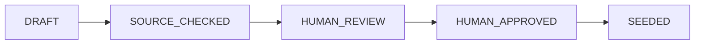

# Hailey — Content Plan

| | |
|---|---|
| Version | 0.1 |
| Date | 2026-10-05 |
| Status | Active — hackathon seed |
| Basis | `Hailey-SRS.md` §3.11 / §5.5 · PRD · Execution Plan |
| Owner | Solo builder; human review required |

> 🟤 **Editorial principle:** Hailey must look like a real cultural field guide, not a database populated with random placeholders.

---

## 1. Content objective

The seed dataset exists to make the complete product journey demonstrable:

```text
Culture / Topic
      ↓
Tags
      ↓
Community
      ↓
Posts
      ↓
Collection
      ↓
Contribution
      ↓
Curator approval
      ↓
Verified contribution
```

The dataset must also provide enough overlapping tags for the feed to demonstrate personalization and `WhyStamp`.

---

## 2. Required seed targets

The SRS establishes:

| Entity | Minimum |
|---|---:|
| Tags | ≥ 60 |
| Tag edges | ≥ 100 |
| Communities | ≥ 8 |
| Posts | ≥ 60 |
| Collections | ≥ 6 |
| Demo accounts | Required for demo flow |

Do not silently reduce these targets.

If the Execution Plan establishes a different approved target after a scope decision, follow that document and record the change.

---

## 3. Content model

### Culture/topic

A topic should have:

- clear name
- category/kind
- related tags
- community relationship
- sourced explanatory content where appropriate

### Tags

Examples of kinds already supported by the schema include:

- culture
- music
- fashion
- food
- art
- film
- language
- heritage
- internet
- place

Tags should form meaningful relationships rather than random edges.

### Communities

Each community should have:

- clear identity
- relevant tags
- posts
- collection where appropriate
- enough overlap with other topics to make discovery useful

### Posts

Each seeded post should have:

- original short text
- relevant tags
- author/editorial identity
- source metadata where required
- image metadata where used
- `is_editorial` flag

---

## 4. Recommendation dataset design

Do not create isolated topics.

Create deliberate overlap:

```text
User interest:
Streetwear
        ↓
Tag edge
        ↓
Photography
        ↓
Post A

User interest:
Streetwear
        ↓
Tag edge
        ↓
Music
        ↓
Post B
```

The purpose is to make it possible to demonstrate:

- different interests
- overlapping tags
- save signals
- explainable ranking
- culture discovery

---

## 5. Editorial source rules

For heritage/educational claims:

- use a credible source
- record the source URL
- inspect the source
- preserve attribution
- avoid unsupported claims

For images:

- use only clearly licensed/public-domain material
- record source/file page URL
- record licence/attribution
- verify that the URL loads
- do not assume a search-result image is licensed

Recommended source classes include:

- Wikimedia Commons
- official cultural institutions
- original creator pages
- clearly licensed/open sources

Do not invent URLs.

---

## 6. Content review record

Create/maintain:

```text
docs/SEED-REVIEW.md
```

Recommended fields:

| Post | Source URL | Image URL | Licence | Verified | Reviewer note |
|---|---|---|---|---|---|

A record should not be marked verified unless a human has checked it.

---

## 7. Editorial workflow



### DRAFT

Content is being prepared.

### SOURCE_CHECKED

Source URL/licence has been inspected.

### HUMAN_REVIEW

Developer reviews factual wording and cultural framing.

### HUMAN_APPROVED

Content is accepted for the demo dataset.

### SEEDED

Content is inserted through the idempotent seed process.

---

## 8. Writing rules

### Do

- write short factual descriptions
- use neutral language
- explain context
- cite sources
- preserve attribution
- avoid overclaiming

### Do not

- invent historical claims
- invent cultural practices
- use stereotypes
- use flags as substitutes for culture
- use generic clip-art as cultural representation
- copy long source passages
- fabricate licences
- fabricate URLs

---

## 9. Image rules

Every seeded image should have:

```text
media_url
media_credit
source/file-page URL
licence
```

If verification is unavailable:

```text
media_url = null
```

and record the item in `SEED-REVIEW.md`.

Do not leave an unverified image URL in production seed data merely because it looks plausible.

---

## 10. Editorial identity

Seed content should be clearly distinguishable from normal user-generated content.

Use the existing:

```text
is_editorial
```

flag where defined by the SRS/data model.

The UI may label content as editorial where the product design calls for it.

---

## 11. Demo dataset requirements

The demo must contain enough content to exercise:

- Explore
- onboarding
- personalized feed
- `WhyStamp`
- community membership
- posts
- collections
- contribution
- curator approval
- attestation
- verification

The dataset should intentionally contain:

- overlapping tags
- multiple communities
- multiple contributors
- approved collection items
- at least one contribution suitable for the live demo

---

## 12. Seed quality gate

Before Day 8 feature freeze:

- [ ] Minimum entity counts satisfied.
- [ ] Seed process is idempotent.
- [ ] Every editorial post has appropriate metadata.
- [ ] Heritage/educational claims have sources.
- [ ] Images have verified source/licence information.
- [ ] `SEED-REVIEW.md` is complete.
- [ ] No placeholder content remains in the hero flow.
- [ ] Recommendation overlap is sufficient.
- [ ] Demo contribution exists.
- [ ] No fabricated source/licence information.

---

## 13. Human review rule

Automated generation may help prepare seed records.

It does not replace editorial verification.

If a claim, image, source or licence is uncertain:

> **Leave it out rather than fabricate it.**

