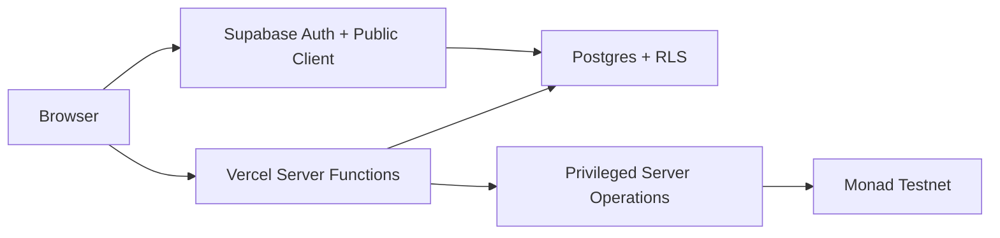

# Hailey — Security Model

| | |
|---|---|
| Version | 0.1 |
| Date | 2026-10-05 |
| Status | Active — hackathon build |
| Basis | `Hailey-SRS.md` §5–§7 · `Hailey-System-Design.md` §10 · Architecture |
| Security posture | Testnet / hackathon / unaudited |

> 🔴 **Core rule:** the browser is an untrusted client. Authorization must be enforced at the server/database/contract boundary, not by hiding buttons in the UI.

---

## 1. Trust boundaries



### Boundary 1 — Browser

Treat all browser input as attacker-controlled.

Never trust:

- user IDs
- roles
- wallet addresses
- contribution status
- community membership
- approval state
- client-calculated authorization

### Boundary 2 — Supabase

RLS is the database authorization boundary for user data.

### Boundary 3 — Server functions

Privileged operations occur only server-side.

### Boundary 4 — Monad

The contract is the final authority for onchain attestation state.

---

## 2. Secret handling

The following must remain server-only:

```text
SUPABASE_SERVICE_ROLE_KEY
ATTESTOR_PRIVATE_KEY
```

They must NEVER:

- use a `VITE_` prefix
- appear in frontend source
- appear in browser bundles
- appear in Git
- appear in logs
- appear in documentation
- appear in API responses
- be pasted into chat

Browser-safe variables are limited to variables intentionally designed for public exposure.

---

## 3. Authentication

Supabase Auth provides the user session.

Every privileged server request must:

1. Receive the authenticated request.
2. Validate the JWT/session.
3. Determine the authenticated user from the verified token.
4. Authorize the requested action.
5. Validate request data.
6. Perform the mutation.

Never accept an arbitrary `user_id` from the browser as proof of identity.

---

## 4. Authorization

### Member

Can perform member actions permitted by the SRS.

### Curator

Must have the `curator` role for the target community.

### Admin/operator

Database/server access is an operator responsibility, not a normal browser role.

### Critical rule

Hiding a curator button is not authorization.

The server/database must reject unauthorized requests.

---

## 5. RLS model

Every application table must have RLS enabled according to the existing System Design.

Minimum verification:

| Asset | Required control |
|---|---|
| User interests | Owner-only private access |
| Profiles | Public/private fields according to SRS |
| Posts | Author ownership for mutation |
| Reactions | User ownership |
| Contributions | Protected state transitions |
| Wallet nonces | Server-controlled |
| Curator actions | Role membership |
| Community membership | Correct membership boundary |

---

## 6. Contribution trust boundary

A contribution follows:

```text
Contributor
    ↓
Pending item
    ↓
Curator authorization
    ↓
Approved contribution
    ↓
Deterministic content hash
    ↓
Server relayer
    ↓
Monad
```

The contributor cannot approve their own item.

The client cannot directly set:

```text
approved
attested
tx_hash
```

as a substitute for the server/contract workflow.

---

## 7. Wallet linking

Recommended v1 flow:

```text
Server generates nonce
        ↓
User signs nonce
        ↓
Server verifies signature
        ↓
Server confirms expected address
        ↓
Nonce is consumed
        ↓
Wallet association persisted
```

### Threats

| Threat | Control |
|---|---|
| Fake wallet claim | Server-side signature verification |
| Replay | Single-use nonce |
| Wrong account | Compare recovered address |
| Wrong chain | Detect/request Monad testnet |
| Popup rejection | Safe UI failure |
| Nonce disclosure | Do not expose reusable credentials |

---

## 8. Attestation security

The relayer is the only trusted writer in v1.

The server must:

1. Confirm authenticated user.
2. Confirm contribution exists.
3. Confirm approval.
4. Confirm contributor identity.
5. Compute deterministic hash.
6. Check duplicate state.
7. Check wallet condition.
8. Check relayer balance.
9. Submit through server-side wallet.
10. Record transaction state.

### Contract controls

The contract enforces:

- only `attestor` may attest
- duplicate content hash rejected
- successful attestation increments count
- attestor rotation restricted
- no personal data/free text stored

---

## 9. Threat matrix

| ID | Threat | Control | Test |
|---|---|---|---|
| SEC-01 | Service-role exposure | Server-only environment | Bundle inspection |
| SEC-02 | Relayer key exposure | Server-only environment | Bundle/Git inspection |
| SEC-03 | Curator impersonation | Server-side role check | RLS/API tests |
| SEC-04 | Self approval | Server/database rule | Negative test |
| SEC-05 | Duplicate attestation | Unique hash + contract guard | Contract test |
| SEC-06 | Wallet replay | Single-use nonce | Wallet test |
| SEC-07 | XSS | Plain-text rendering | Code review |
| SEC-08 | Invalid API input | Schema/validation | API test |
| SEC-09 | Unauthorized DB mutation | RLS | RLS test |
| SEC-10 | Fake verified state | Server/contract state | E2E test |
| SEC-11 | Relayer drained | Balance threshold | API test |
| SEC-12 | RPC failure | Explicit submitted/failed state | Integration test |

---

## 10. Input validation

Validate at the server boundary:

- IDs
- UUIDs
- URLs
- text length
- enum values
- wallet addresses
- community slugs
- contribution state transitions

Never rely only on TypeScript types.

---

## 11. XSS and user content

User-generated content must be rendered as text.

Avoid unsafe HTML rendering such as `dangerouslySetInnerHTML` unless there is an explicit, reviewed sanitization boundary.

Do not trust:

- post titles
- notes
- URLs
- profile fields
- collection descriptions

---

## 12. Onchain privacy

The contract stores no personal data or free text.

Only the defined verification information is written onchain.

The UI must tell users that verified contributions are permanent/immutable where required by the SRS.

---

## 13. Incident response

If a secret may have leaked:

1. Stop the affected operation.
2. Revoke/rotate the secret.
3. Determine where it appeared.
4. Remove it from current files.
5. Inspect Git history.
6. Determine whether the credential was usable.
7. Record the incident.
8. Re-test the security boundary.
9. Resume only after the boundary is restored.

Never simply delete the visible line and assume the secret is safe.

---

## 14. Security acceptance gate

Before submission:

- [ ] No secrets in repository.
- [ ] No server-only secret uses `VITE_`.
- [ ] Bundle does not contain private keys.
- [ ] All tables have intended RLS.
- [ ] Curator authorization tested.
- [ ] Self-approval rejected.
- [ ] Wallet nonce replay rejected.
- [ ] Duplicate attestation rejected.
- [ ] Contract tests pass.
- [ ] Production API errors do not leak secrets.
- [ ] Testnet/unaudited status is disclosed.

