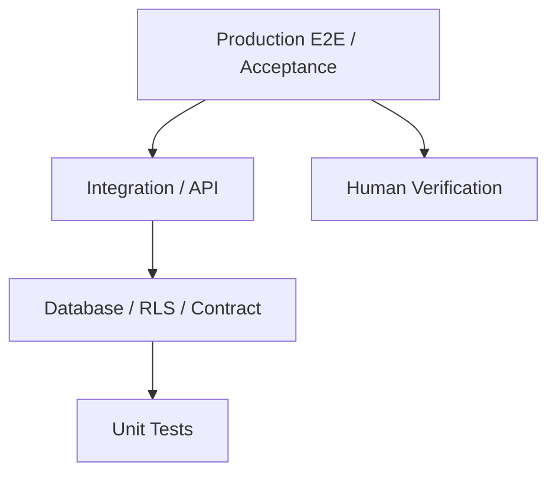
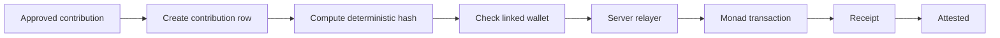

# Hailey — Test Plan

| | |
|---|---|
| Version | 0.1 |
| Date | 2026-10-05 |
| Status | Active — hackathon build |
| Basis | `Hailey-PRD.md` · `Hailey-SRS.md` · `Hailey-Execution-Plan.md` · `Hailey-Task-Spec.md` |
| Priority | **P0** = must verify · **P1** = only if ahead · **P2** = not part of v1 |

> 🟢 **Testing principle:** code existing is not evidence. A Hailey feature is complete only when its expected behaviour can be demonstrated, its security boundary is tested, and its production acceptance criteria are satisfied.

---

## 1. Authority and evidence

The test plan follows the existing SRS acceptance test and the implementation sequence in the Execution Plan.

**Evidence hierarchy**

1. Production behaviour on the deployed application.
2. Automated test output.
3. Database/RLS verification.
4. Smart-contract test output and explorer evidence.
5. Human visual/manual verification.
6. Code inspection.

Automated tools must not claim a manual verification they did not perform.

---

## 2. Test pyramid



| Layer | Purpose | Evidence |
|---|---|---|
| Unit | Pure logic and deterministic transformations | Test output |
| Database | Constraints, functions, state transitions | SQL/test output |
| RLS | Authorization at data boundary | Two-user/anonymous checks |
| API | Auth, validation, authorization, privileged actions | Request/response tests |
| Contract | Access control and duplicate protection | `forge test` |
| Integration | Cross-layer behaviour | Automated test output |
| E2E | Complete user journey | Browser run |
| Production | Real deployment | Production checklist |
| Human | Wallet, phone, visual and account checks | Manual PASS/FAIL |

---

## 3. Test identifiers

| Prefix | Area |
|---|---|
| UT | Unit |
| DB | Database |
| RLS | Row Level Security |
| API | Server/API |
| FE | Frontend |
| WAL | Wallet |
| ATT | Attestation |
| CHAIN | Smart contract |
| E2E | End-to-end |
| MOB | Mobile |
| SEC | Security |
| PROD | Production |

---

## 4. Database tests

| ID | Test | Expected |
|---|---|---|
| DB-01 | Apply all numbered migrations to a clean database | Migrations complete without manual edits |
| DB-02 | Re-run seed process | No duplicate rows |
| DB-03 | Invalid foreign-key relationship | Database rejects the write |
| DB-04 | Duplicate unique value | Database rejects the duplicate |
| DB-05 | Contribution state transition | Only valid states/transitions are accepted |
| DB-06 | Feedback uniqueness | Same user/post cannot create a second answer |
| DB-07 | Wallet nonce lifecycle | Nonce cannot be reused after successful verification |
| DB-08 | Feed SQL function | Returns expected rows and `why` information |

> **Migration rule:** an applied migration is never silently edited. Fixes require a new numbered migration.

---

## 5. RLS tests

Run with at least two normal users and an anonymous client.

| ID | Scenario | Expected |
|---|---|---|
| RLS-01 | User A reads User B private interests | Denied / invisible |
| RLS-02 | User A updates User B profile/private data | Denied |
| RLS-03 | Member attempts curator-only action | Denied |
| RLS-04 | Contributor attempts self-approval | Denied |
| RLS-05 | User directly modifies protected contribution state | Denied |
| RLS-06 | Unauthorized user reads another user's wallet nonce | Denied |
| RLS-07 | User deletes another user's post | Denied |
| RLS-08 | Anonymous user reads public content | Allowed only where SRS permits |
| RLS-09 | Anonymous user accesses private data | Denied |
| RLS-10 | Service-role operation | Used only server-side |

---

## 6. API and integration tests

Every privileged endpoint must verify the Supabase JWT and validate request input.

| ID | Scenario | Expected |
|---|---|---|
| API-01 | Missing authentication | Rejected |
| API-02 | Invalid JWT | Rejected |
| API-03 | Valid member request | Accepted when authorized |
| API-04 | Curator endpoint by non-curator | Rejected |
| API-05 | Malformed input | Validation error; no mutation |
| API-06 | Duplicate contribution | Idempotent/rejected according to SRS |
| API-07 | Relayer balance below minimum | Clear failure; no transaction |
| API-08 | Internal exception | Safe error; no secret leakage |

---

## 7. Feed and personalization tests

The feed must preserve the server-returned ranking order.

| ID | Scenario | Expected |
|---|---|---|
| FE-01 | Two users have different interests | Their feed ordering can differ |
| FE-02 | User saves a post sharing a tag | Related content receives the intended signal |
| FE-03 | User hides a post | Hidden post never returns |
| FE-04 | Feed reload | Ordering/signals persist |
| FE-05 | `why` explanation | Explanation matches actual returned signals |
| FE-06 | User has no positive weights | Editorial/newest fallback appears |
| FE-07 | Pagination/load more | Existing order remains stable |
| FE-08 | Explore interleave | Explore content is inserted according to the specified rule |
| FE-09 | Relevance prompt | Deterministic cards remain stable after reload |

---

## 8. Wallet tests

| ID | Scenario | Expected |
|---|---|---|
| WAL-01 | Connect supported wallet on Monad | Wallet connects |
| WAL-02 | Wrong network | User is prompted to switch |
| WAL-03 | Server creates nonce | Nonce is unique and server-controlled |
| WAL-04 | Correct signature | Wallet is linked |
| WAL-05 | Wrong signature | Linking fails |
| WAL-06 | Reuse nonce | Rejected |
| WAL-07 | User rejects popup | Clear non-fatal error |
| WAL-08 | Wallet absent | Contribution remains `awaiting_wallet` where specified |

> **Human verification required:** the real wallet popup and phone flow must be tested by the developer.

---

## 9. Smart-contract tests

The contract must satisfy the SRS `SC-*` requirements.

| ID | Scenario | Expected |
|---|---|---|
| CHAIN-01 | Current attestor calls `attest` | Success |
| CHAIN-02 | Non-attestor calls `attest` | Reverts |
| CHAIN-03 | Same content hash is attested twice | Reverts |
| CHAIN-04 | Successful attestation | Count increments |
| CHAIN-05 | Successful attestation | `Attested` event emitted |
| CHAIN-06 | Current attestor rotates attestor | Success |
| CHAIN-07 | Non-attestor rotates attestor | Reverts |
| CHAIN-08 | Zero address is supplied where forbidden | Reverts |

Run:

```text
forge test
```

Record the result in the day-wrap/PROGRESS evidence.

---

## 10. Attestation tests



| ID | Scenario | Expected |
|---|---|---|
| ATT-01 | Approved item without wallet | `awaiting_wallet` |
| ATT-02 | Approved item with wallet | Relayer attempts transaction |
| ATT-03 | Receipt within timeout | `attested` |
| ATT-04 | Receipt timeout | `submitted` |
| ATT-05 | Transaction reverts | `failed` |
| ATT-06 | Duplicate content hash | No second attestation |
| ATT-07 | Relayer balance below threshold | Transaction is not sent |
| ATT-08 | Successful attestation | Explorer transaction link is available |
| ATT-09 | `/verify/:address` | Counts come from chain, not DB |

---

## 11. Golden E2E acceptance test

### E2E-01 — Complete Hailey hero journey

```text
Visitor
  ↓
Explore
  ↓
Sign up
  ↓
Choose 3 interests
  ↓
Personalised feed
  ↓
Why explanation
  ↓
Culture page
  ↓
Join community
  ↓
Collection
  ↓
Propose contribution
  ↓
Pending
  ↓
Curator approval
  ↓
Wallet linked
  ↓
Monad attestation
  ↓
Verified state
  ↓
/verify/<address>
```

### Acceptance

- [ ] Fresh account works.
- [ ] Three interests persist.
- [ ] Feed shows explainable relevance.
- [ ] Save/hide behaviour persists.
- [ ] Community membership works.
- [ ] Contribution enters pending state.
- [ ] Non-curator cannot approve.
- [ ] Curator can approve.
- [ ] Approved contribution is attested when wallet conditions are satisfied.
- [ ] Verified seal appears after successful receipt.
- [ ] `/verify/<address>` reads the onchain count.
- [ ] No manual database edits are required during the hero flow.

---

## 12. Mobile tests

Minimum viewport: **360 px**.

| ID | Check | Expected |
|---|---|---|
| MOB-01 | Landing | No horizontal overflow |
| MOB-02 | Onboarding | Interest selection usable |
| MOB-03 | Feed | Cards readable and actions reachable |
| MOB-04 | Community | Join/contribution controls usable |
| MOB-05 | Wallet | Popup/redirect flow usable |
| MOB-06 | Verify | Address/count display remains readable |
| MOB-07 | Navigation | Mobile navigation does not cover content |
| MOB-08 | Keyboard | Form controls remain visible |

---

## 13. Security tests

| ID | Threat | Expected control |
|---|---|---|
| SEC-01 | Service-role key in client bundle | Never present |
| SEC-02 | Attestor private key in client bundle | Never present |
| SEC-03 | `VITE_` prefix on server secret | Never present |
| SEC-04 | User text rendered as HTML | No unsafe HTML rendering |
| SEC-05 | Unauthorized API call | JWT/authorization rejection |
| SEC-06 | Curator impersonation | Server-side role check |
| SEC-07 | Self approval | Rejected |
| SEC-08 | Duplicate attestation | Rejected |
| SEC-09 | Nonce replay | Rejected |
| SEC-10 | Secrets in Git history | Manually inspect before submission |

---

## 14. Production acceptance

| ID | Scenario | Evidence | Status |
|---|---|---|---|
| PROD-01 | Public URL opens logged out | Browser | NOT VERIFIED |
| PROD-02 | `/explore` works | Browser | NOT VERIFIED |
| PROD-03 | Fresh signup | Production account | NOT VERIFIED |
| PROD-04 | Three interests persist | Database/UI | NOT VERIFIED |
| PROD-05 | Feed shows why | Browser | NOT VERIFIED |
| PROD-06 | Save/hide survives reload | Browser | NOT VERIFIED |
| PROD-07 | Community join works | Browser | NOT VERIFIED |
| PROD-08 | Contribution can be proposed | Browser | NOT VERIFIED |
| PROD-09 | Curator approval works | Browser | NOT VERIFIED |
| PROD-10 | Monad tx succeeds | Explorer | NOT VERIFIED |
| PROD-11 | Verified seal appears | Browser | NOT VERIFIED |
| PROD-12 | `/verify/<address>` matches chain | Explorer + app | NOT VERIFIED |
| PROD-13 | Mobile hero flow works | Real phone | NOT VERIFIED |
| PROD-14 | No secrets in repository | Git inspection | NOT VERIFIED |

---

## 15. Human-only verification

The following must be performed by the developer:

- [ ] Real phone test.
- [ ] Real wallet popup/signing.
- [ ] Correct network selection.
- [ ] Production environment variables.
- [ ] Supabase production state.
- [ ] Monad explorer transaction.
- [ ] Seed content/source/licence review.
- [ ] Final visual inspection.
- [ ] Hackathon rules and submission requirements.

> **Rule:** if a human has not performed it, label it `NOT VERIFIED`.

---

## 16. Failure policy

If a P0 test fails:

1. Record the exact failure.
2. Do not hide the failure.
3. Determine whether the issue is implementation, environment, data or external dependency.
4. Fix the smallest root cause.
5. Re-run the relevant test.
6. Update `PROGRESS.md`.
7. If it cannot be fixed within the day's budget, cut the next P1 item before compressing the final production/verification window.

