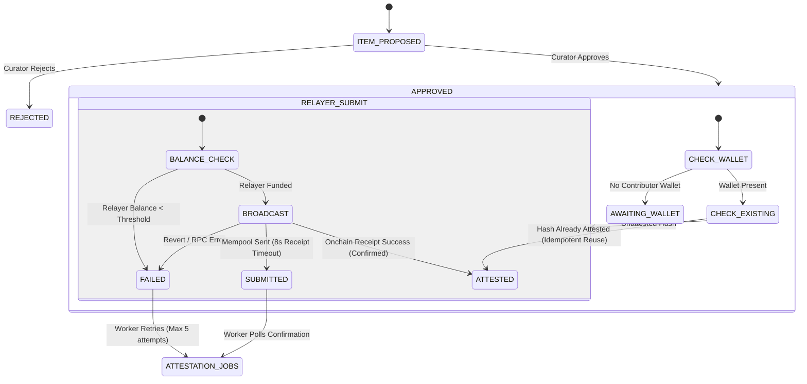

# Blockchain Provenance & Attestation Guide

## 1. Overview & Core Philosophy

Hailey integrates blockchain attestation on **Monad Testnet (Chain ID 10143)** to establish an immutable, timestamped cryptographic proof of community-curated cultural contributions.

### Authoritative Architecture Principles
> [!IMPORTANT]
> **Blockchain attestation proves that a specific cryptographic content identity was attested. It does not prove that the content is safe, legal, original, or appropriate for a particular user.**

> [!WARNING]
> **Perceptual similarity does not establish provenance.** Visual similarity detected via perceptual hashing (dHash) does not prove identical authorship, licensing, or provenance.

The blockchain layer in Hailey is designed strictly as an **attestation ledger**. It is **NOT**:
- A moderation engine.
- A violence or graphic-content detector.
- An age-verification gatekeeper.
- A profanity filter.
- A near-duplicate detector.
- The source of truth for user eligibility or profile status.

Authoritative moderation, compliance, and user eligibility state remain managed strictly within the application database and service tier.

---

## 2. Separation of Content Identity Primitives

Hailey strictly isolates four cryptographic and perceptual primitives:

| Identity Primitive | Implementation | Storage / Output | Primary Purpose |
| :--- | :--- | :--- | :--- |
| **Media Byte Identity** | `sha256Bytes(data)` | `media_assets.sha256_hash` (`0x...` 64 hex) | Exact binary duplicate detection and byte integrity. |
| **Canonical Content Identity (v2)** | `computeContentHashV2(params)` | `contributions.content_hash` (`0x...` 64 hex / `bytes32`) | Deterministic application content identity across identical proposals. |
| **Legacy Content Identity (v1)** | `computeContentHashV1(params)` | `contributions.content_hash` (`0x...` 64 hex / `bytes32`) | Preserved historical compatibility for legacy onchain attestations. |
| **Perceptual Similarity** | `computeImagePerceptualHash(pixels)` | `media_assets.perceptual_hash` (`0x...` 16 hex / 64-bit) | Fuzzy visual matching (dHash) for resized/recompressed media. **Never sent onchain.** |

---

## 3. Provenance Data Model

The `contributions` table records the full provenance chain linking items, contributors, communities, media assets, and onchain attestation state:

```sql
-- Extended in migration 0010
alter table public.contributions
  add column if not exists content_hash_version text not null default 'v1'
  check (content_hash_version in ('v1', 'v2'));

alter table public.contributions
  add column if not exists media_asset_id uuid references public.media_assets(id) on delete set null;
```

### Column Reference:
- `id` (`uuid`): Primary key.
- `item_id` (`uuid`): References `collection_items(id)` (unique).
- `user_id` (`uuid`): Contributor profile ID.
- `community_id` (`uuid`): Community collective ID.
- `content_hash` (`text`): 32-byte lowercase hex string (`^0x[0-9a-f]{64}$`).
- `content_hash_version` (`text`): `'v1'` or `'v2'`.
- `media_asset_id` (`uuid`): Nullable reference to `media_assets(id)` when media is present.
- `status` (`attest_status`): `'awaiting_wallet' | 'submitted' | 'attested' | 'failed'`.
- `tx_hash` (`text`): Monad Testnet transaction hash.
- `attested_at` (`timestamptz`): Confirmation timestamp when receipt succeeded.

---

## 4. Attestation State Machine & Lifecycle

The attestation flow guarantees that no record is marked `attested` without definitive onchain confirmation.



### Lifecycle Rules:
1. **No Premature Attestation:** A submission in the mempool or timed-out receipt remains in `submitted` status until confirmed.
2. **Idempotency & Replay Protection:**
   - If `content_hash` is already attested in the database or onchain (`HaileyContributions.attested[hash] == true`), the system reuses the existing attestation record without submitting a reverting transaction.
   - If a concurrent transaction succeeds and `relayer.attest()` encounters an `AlreadyAttested` error, the result is treated gracefully as `status: 'attested'`.
3. **Failure Recovery:** Network or gas failures transition the job to `status: 'failed'` in `contributions` and record the error reason in `attestation_jobs`, allowing scheduled background workers to retry.

---

## 5. Smart Contract Interface (`HaileyContributions.sol`)

The deployed Solidity contract operates with minimal surface area:

```solidity
// Attestation registry
mapping(bytes32 => bool) public attested;
mapping(address => mapping(bytes32 => uint32)) public count;

function attest(
    address contributor,
    bytes32 communityId,
    bytes32 contentHash,
    Kind kind
) external;
```

- **Reverts:**
  - `NotAttestor()`: Caller is not Hailey's authorized relayer address.
  - `AlreadyAttested()`: `contentHash` has already been permanently recorded.
  - `ZeroAddress()`, `ZeroCommunityId()`, `ZeroContentHash()`: Guard rails against null inputs.

---

## 6. Server Trust Boundary & Relayer Security

1. **Private Key Protection:** `RELAYER_PRIVATE_KEY` is loaded strictly on the backend Node.js runtime and never exposed to clients or written to client-facing assets.
2. **Untrusted Client Inputs:** Clients cannot supply arbitrary `content_hash`, `attested`, or `tx_hash` values. All hashes are calculated server-side from canonicalized data.
3. **Curator Authorization:** Approvals require an authenticated JWT, verification of curator role in `memberships`, and anti-self-dealing checks (`decided_by <> added_by`).

---

## 7. Onchain Verification APIs

Verification can be executed via client or backend services:

### Contributor Community Breakdown
```javascript
import { getCommunityAttestationCounts } from '@/features/verification/services/attestationService'

const counts = await getCommunityAttestationCounts(walletAddress, communities, contractAddress)
// Returns { community, count, status: 'success' | 'unavailable' | 'unconfigured' }
```

### Single Content Hash Verification
```javascript
import { verifyContentHashOnchain } from '@/features/verification/services/attestationService'

const verification = await verifyContentHashOnchain(contentHash, contractAddress)
// Returns { contentHash, attested: boolean, status: 'verified' | 'unconfigured' | 'invalid_hash' }
```
